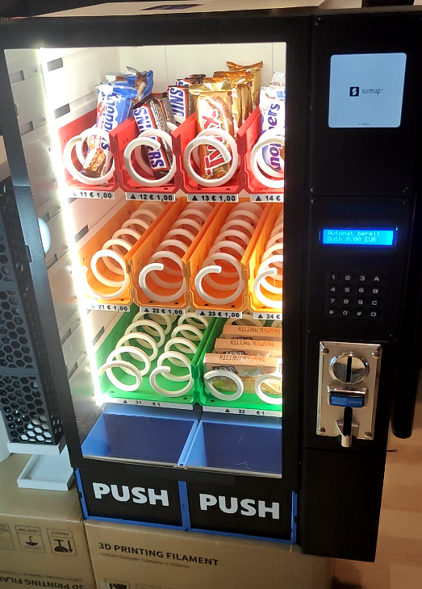
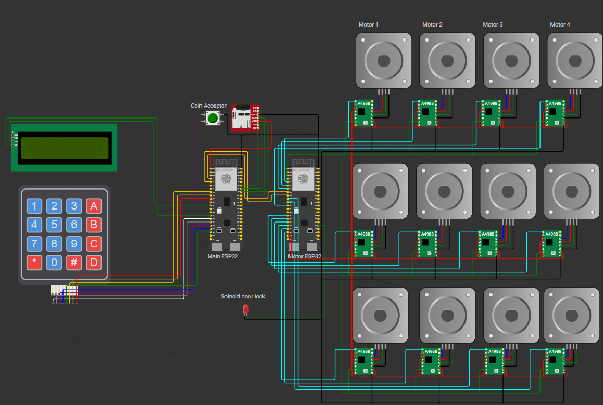
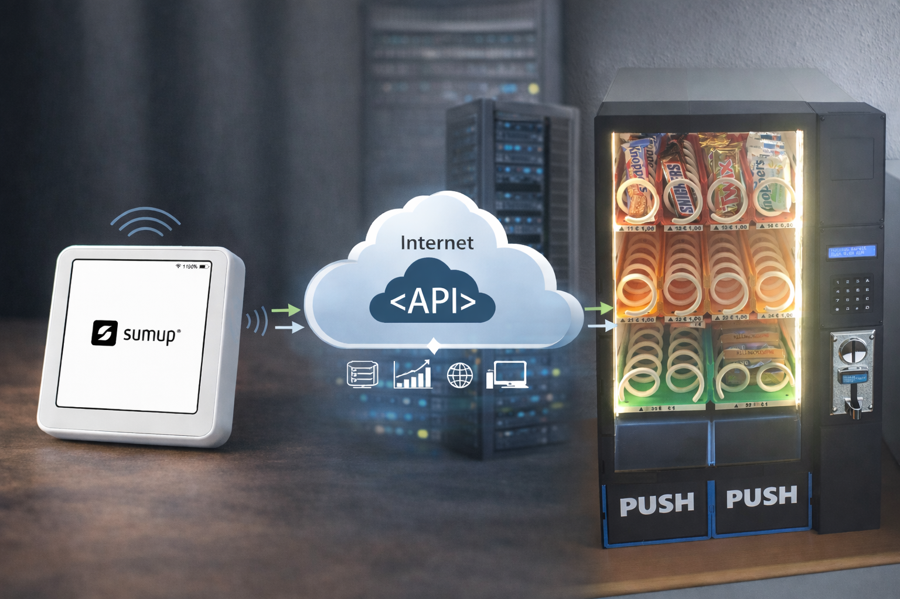

# Vending Machine Firmware (ESP32-S3)



Language:

- [Deutsch](#deutsch)
- [English](#english)

Current firmware version in code: `1.6.2`

Ready-to-flash firmware releases are available here:

- https://github.com/kreativwelt3d/ESP32-Vending-Machine/releases

Kurzanleitung Flashen:

1. Passende `.bin`-Datei aus den Releases herunterladen.
2. ESP32-S3 per USB verbinden.
3. Firmware z. B. mit dem [ESP Web Tool](https://espressif.github.io/esptool-js/) oder `esptool` auf den ESP flashen.
4. Nach dem Flashen den ESP neu starten und den ersten Setup-Dialog auf dem LCD durchlaufen.

Quick flash guide:

1. Download the matching `.bin` file from the releases page.
2. Connect the ESP32-S3 via USB.
3. Flash the firmware with the [ESP Web Tool](https://espressif.github.io/esptool-js/) or `esptool`.
4. Reboot the ESP and complete the initial setup shown on the LCD.

---

## Deutsch

### Ueberblick

Diese Firmware steuert den Haupt-ESP eines Verkaufsautomaten. Der ESP32-S3 uebernimmt Anzeige, Tastenfeld, Muenzannahme, SD-Karte, WLAN/Weboberflaeche und die Kommunikation mit dem separaten Motor-ESP.

3D-Druck-Dateien und Hinweise zu den verfuegbaren Modifikationen findest du in [3DPrinting files/README.md](3DPrinting%20files/README.md).

### Funktionsumfang

- 4x4-Keypad fuer Bedienung und Service-Menue
- 16x2-LCD ueber I2C
- Erststart- und Service-Keypad-Setup zur Tasten-Zuordnung
- Muenzpruefer mit frei konfigurierbaren Puls/Wert-Mappings
- SD-Karte fuer Kassenbuch
- WLAN-Konfiguration
- Webserver fuer Konfiguration und Status
- Kommunikation mit separatem Motor-ESP per UART
- Ansteuerung von bis zu 24 Motoren ueber den separaten Motor-ESP
- Persistente Speicherung ueber Preferences (NVS)
- SumUp-Anbindung fuer Kartenzahlung
- Erstellung einer gemergten Firmware-Datei fuer einfacheres Flashen

### Hardware und Verdrahtung



*Aktuelle 5-Volt-Verdrahtung. Das Bild zeigt die komplette Verdrahtung aller Komponenten. Die 12V-Leitungen wurden bewusst weggelassen, um die Logik besser darzustellen.*

Alle aktuell in der Firmware belegten GPIOs:

| Funktion | Signal | GPIO |
|----------|--------|------|
| LCD I2C | SDA | `8` |
| LCD I2C | SCL | `9` |
| Keypad | Row 1 | `10` |
| Keypad | Row 2 | `11` |
| Keypad | Row 3 | `12` |
| Keypad | Row 4 | `13` |
| Keypad | Col 1 | `14` |
| Keypad | Col 2 | `15` |
| Keypad | Col 3 | `16` |
| Keypad | Col 4 | `17` |
| Muenzpruefer | Pulse input | `18` |
| Motor-ESP UART | TX vom Haupt-ESP | `4` |
| Motor-ESP UART | RX zum Haupt-ESP | `5` |
| SD-Karte SPI | SCK / CLK | `39` |
| SD-Karte SPI | MOSI / DI | `40` |
| SD-Karte SPI | MISO / DO | `41` |
| SD-Karte SPI | CS / SS | `42` |

Nicht aufgefuehrte GPIOs sind in der aktuellen Hauptplatinen-Firmware nicht belegt.

#### LCD

- Display: `16x2`
- I2C-Start im Code: `Wire.begin(8, 9)`
- Typische I2C-Adresse: `0x27`

Verdrahtung:

- `SDA -> GPIO 8`
- `SCL -> GPIO 9`
- `VCC -> 5V` oder `3.3V` je nach LCD-Backpack
- `GND -> GND`

#### Keypad

Logische 4x4-Matrix:

|      | Col 1 | Col 2 | Col 3 | Col 4 |
|------|-------|-------|-------|-------|
| Row 1 | 1 | 2 | 3 | A |
| Row 2 | 4 | 5 | 6 | B |
| Row 3 | 7 | 8 | 9 | C |
| Row 4 | * | 0 | # | D |

Physische Verdrahtung:

- `Row 1 -> GPIO 10`
- `Row 2 -> GPIO 11`
- `Row 3 -> GPIO 12`
- `Row 4 -> GPIO 13`
- `Col 1 -> GPIO 14`
- `Col 2 -> GPIO 15`
- `Col 3 -> GPIO 16`
- `Col 4 -> GPIO 17`

Hinweise:

- Beim ersten Start ohne gespeicherte Tasten-Zuordnung erscheint automatisch ein Keypad-Setup auf dem LCD.
- Das Setup kann spaeter erneut im Service-Menue ueber `Keypad Setup` gestartet werden.

#### Muenzpruefer

- Pulssignal-Eingang: `GPIO 18`
- Im Code als `INPUT_PULLUP` konfiguriert

Verdrahtung:

- `Signal / pulse out -> GPIO 18`
- `GND -> GND`

#### SD-Karte

Die SD-Karte wird im SPI-Modus betrieben.

Aktuell funktionierende Verdrahtung:

- `CLK / SCK -> GPIO 39`
- `MOSI / DI -> GPIO 40`
- `MISO / DO -> GPIO 41`
- `CS / SS -> GPIO 42`
- `3V3 -> 3.3V`
- `GND -> GND`

Hinweise:

- Diese Belegung wurde erfolgreich getestet.
- Der testweise Pinblock `35/36/37/38` kann auf diesem Board zu Boot-Problemen fuehren.

#### Motor-ESP UART

Der Haupt-ESP kommuniziert mit dem separaten Motor-ESP ueber UART:

- `TX Haupt-ESP -> GPIO 4`
- `RX Haupt-ESP -> GPIO 5`
- Baudrate: `115200`

Verdrahtung:

- `GPIO 4` des Haupt-ESP an `RX` des Motor-ESP
- `GPIO 5` des Haupt-ESP an `TX` des Motor-ESP
- `GND` beider ESPs verbinden

Weitere Details zur Motor-Platine stehen in [motor_controller/README.md](motor_controller/README.md).

### Bedienkonzept

#### Wichtige Tasten

- `A` = Menue nach oben / Zeichensatz zurueck
- `B` = Menue nach unten / Zeichensatz weiter
- `C` = Zurueck / Abbrechen
- `D` = Bestaetigen / Enter
- `*` = Loeschen / Backspace
- `#` = regulaeres Eingabezeichen in Textfeldern

#### Service-Menue oeffnen

Im Normalmodus wird das Service-Menue ueber eine schnelle Kombination aus `*` und `#` geoeffnet. Danach muss die Service-PIN eingegeben werden.

#### Service-Menue

Aktuelle Menuepunkte:

1. `Info`
2. `WiFi`
3. `Admin PIN`
4. `Sprache`
5. `Keypad Setup`
6. `Tuer oeffnen`

### Weboberflaeche

Der integrierte Webserver laeuft auf Port `80`.

Wichtige Bereiche:

- Uebersicht
- WiFi
- E-Mail
- SumUp
- Muenzen
- Schaechte
- Kassenbuch
- Tests

#### SumUp-Konfiguration

Im Tab `SumUp` werden die Parameter fuer die Kartenzahlung hinterlegt:

- `Aktiv`
- `Server Basis-URL`
- `Bearer Token`
- `Machine ID`
- `Currency`
- `Polling Intervall`
- `Timeout`

Beispiel fuer die `Server Basis-URL`:

```text
https://sumup.kreativwelt3d.de/sumup/public
```

Hinweise:

- Die Basis-URL muss auf den oeffentlich erreichbaren PHP-Bridge-Endpunkt zeigen.
- Der Bearer-Token schuetzt die Bridge-Endpunkte `/start` und `/status`.
- `Machine ID` muss mit dem Wert uebereinstimmen, den die Bridge fuer dieselbe Maschine erwartet.

#### SumUp API Bridge

Wenn du keine eigene SumUp API Bridge bauen und betreiben moechtest, kannst du die SumUp API Bridge auf meiner Webseite nutzen:

- https://sumup.kreativwelt3d.de/

Dieser Dienst kostet `5 EUR pro Monat` und kann nach der Anmeldung auf der Webseite ueber Stripe gebucht werden, wenn du keine eigene Bridge einsetzen willst.

Damit wird das Projekt mitfinanziert, und ich freue mich sehr, wenn du mit deiner Buchung dabei mithilfst.

Ueber den Dienst koennen dann beliebig viele SumUp-Terminals angebunden werden.



#### Produkt- und Kartenzahlungsablauf

Die Produktauswahl am 4x4-Keypad erfolgt zweistufig:

- zuerst `Reihe 1-6`
- danach `Fach 1-8`

Beispiel:

- `1` dann `2` = Reihe 1, Fach 2

Wenn genuegend Guthaben vorhanden ist:

- Das Produkt wird direkt ausgegeben.

Wenn Guthaben fehlt und SumUp korrekt konfiguriert ist:

- Das LCD zeigt `Kartenzahlung->A`
- mit `A` wird die Kartenzahlung fuer genau diesen Artikel gestartet
- das LCD zeigt anschliessend `Terminal beachten`
- nach erfolgreicher Transaktion wird die Ware automatisch ausgegeben
- bei fehlgeschlagener oder abgebrochener Zahlung erfolgt keine Ausgabe

Wichtig:

- `A` startet im Normalmodus keine freie Betragsaufladung mehr.
- Die Kartenzahlung ist direkt an den ausgewaehlten Artikel gekoppelt.

#### Muenzkonfiguration

- Frei konfigurierbare Puls/Wert-Mappings
- Bis zu `20` Eintraege
- Weboberflaeche mit `Eintrag hinzufuegen` und `Eintrag entfernen`

#### Login

- Login mit Service-/Admin-PIN
- Session-Cookie: `ESPSESSIONID`

### Persistente Einstellungen

Namespace: `vending`

Gespeichert werden unter anderem:

- Admin-PIN
- WLAN-Daten
- Sprache
- Waehrung
- Keypad-Zuordnung
- Muenz-Mappings
- E-Mail-Konfiguration
- Schacht-Konfiguration

### Setup und Inbetriebnahme

1. Board `esp32-s3-devkitc-1-n16r8` in PlatformIO verwenden.
2. Firmware mit `platformio run` bauen.
3. Fuer einfaches Komplett-Flashen die gemergte Datei `.pio/build/esp32-s3-devkitc-1/firmware-merged.bin` verwenden.
4. Seriellen Monitor mit `115200` Baud oeffnen.
5. Beim Erststart gegebenenfalls das Keypad-Setup auf dem LCD durchlaufen.
6. SD-Karte und WLAN pruefen.
7. Service-Menue und Weboberflaeche fuer weitere Konfiguration verwenden.

### Fehlersuche

#### SD-Karte wird nicht erkannt

- Verdrahtung fuer `GPIO 39/40/41/42` pruefen
- `3.3V` und `GND` pruefen
- Seriellen Monitor beobachten

#### Keypad reagiert falsch

- `Keypad Setup` im Service-Menue erneut ausfuehren
- Verdrahtung von Rows und Cols pruefen

#### Kein Zugriff auf die Webseite

- WLAN-Verbindung pruefen
- IP-Adresse im Info-Screen oder seriellen Monitor nachsehen
- Browser im selben Netzwerk verwenden

### Sicherheit und Grenzen

- Authentifizierung erfolgt ueber PIN und Session-Cookie
- Kein HTTPS/TLS in der aktuellen Firmware
- Fuer produktive Umgebungen sollte ein zusaetzliches Sicherheitskonzept ergaenzt werden

---

## English

### Overview

This firmware controls the main ESP of the vending machine. The ESP32-S3 handles the display, keypad, coin acceptor, SD card, Wi-Fi/web interface, and communication with the separate motor ESP.

3D printing files and notes about the available modifications can be found in [3DPrinting files/README.md](3DPrinting%20files/README.md).

### Features

- 4x4 keypad for normal operation and service menu
- 16x2 LCD via I2C
- Initial and service keypad setup for key mapping
- Coin acceptor with configurable pulse/value mappings
- SD card support for the cashbook
- Wi-Fi configuration
- Web server for configuration and status pages
- UART communication with a separate motor ESP
- Control of up to 24 motors through the separate motor ESP
- Persistent storage via Preferences (NVS)
- SumUp integration for card payments
- Automatic creation of a merged firmware image for easier flashing

### Hardware and wiring


*Current 5-volt wiring. The image shows the complete wiring of all components. The 12V lines were intentionally omitted to make the logic easier to understand.*

GPIOs currently used by the firmware:

| Function | Signal | GPIO |
|----------|--------|------|
| LCD I2C | SDA | `8` |
| LCD I2C | SCL | `9` |
| Keypad | Row 1 | `10` |
| Keypad | Row 2 | `11` |
| Keypad | Row 3 | `12` |
| Keypad | Row 4 | `13` |
| Keypad | Col 1 | `14` |
| Keypad | Col 2 | `15` |
| Keypad | Col 3 | `16` |
| Keypad | Col 4 | `17` |
| Coin acceptor | Pulse input | `18` |
| Motor ESP UART | TX from main ESP | `4` |
| Motor ESP UART | RX to main ESP | `5` |
| SD card SPI | SCK / CLK | `39` |
| SD card SPI | MOSI / DI | `40` |
| SD card SPI | MISO / DO | `41` |
| SD card SPI | CS / SS | `42` |

Unlisted GPIOs are currently unused by the main board firmware.

For the motor ESP pin mapping, see [motor_controller/README.md](motor_controller/README.md).

### User interaction

Important keys:

- `A` = menu up / previous character set
- `B` = menu down / next character set
- `C` = back / cancel
- `D` = confirm / enter
- `*` = delete / backspace
- `#` = regular input character in text fields

The service menu is opened in normal mode by pressing `*` and `#` quickly one after another, then entering the service PIN.

Current service menu items:

1. `Info`
2. `WiFi`
3. `Admin PIN`
4. `Language`
5. `Keypad Setup`
6. `Open door`

### Web interface

The integrated web server runs on port `80`.

Main sections:

- Overview
- WiFi
- Email
- SumUp
- Coins
- Shafts
- Cashbook
- Tests

#### SumUp configuration

The `SumUp` tab contains the parameters for card payments:

- `Active`
- `Server base URL`
- `Bearer token`
- `Machine ID`
- `Currency`
- `Polling interval`
- `Timeout`

Example base URL:

```text
https://sumup.kreativwelt3d.de/sumup/public
```

#### SumUp API Bridge

If you do not want to build and host your own SumUp API bridge, you can use the SumUp API bridge on my website:

- https://sumup.kreativwelt3d.de/

This service costs `EUR 5 per month` and can be booked via Stripe after signing up on the website if you do not want to run your own bridge.

This helps fund the project, and I really appreciate everyone who supports it by subscribing to the service.

The service can be used to connect an unlimited number of SumUp terminals.


#### Product and card payment flow

Product selection on the 4x4 keypad is a two-step process:

- first `row 1-6`
- then `slot 1-8`

Example:

- `1` then `2` = row 1, slot 2

If enough credit is available:

- The product is dispensed immediately.

If there is not enough credit and SumUp is configured correctly:

- the LCD shows `Kartenzahlung->A`
- pressing `A` starts card payment for exactly that item
- the LCD then shows `Terminal beachten`
- after a successful transaction, the product is dispensed automatically
- no product is dispensed if the payment fails or is cancelled

### Persistent settings

Namespace: `vending`

Stored values include:

- admin PIN
- Wi-Fi settings
- language
- currency
- keypad mapping
- coin mappings
- email configuration
- shaft configuration

### Build and flashing

1. Use board `esp32-s3-devkitc-1-n16r8` in PlatformIO.
2. Build with `platformio run`.
3. For easy full flashing, use the merged image `.pio/build/esp32-s3-devkitc-1/firmware-merged.bin`.
4. Open the serial monitor at `115200` baud.
5. Run the LCD keypad setup on first boot if needed.
6. Check SD card and Wi-Fi.
7. Use the service menu and web UI for further configuration.

### Troubleshooting

#### SD card is not detected

- Check wiring for `GPIO 39/40/41/42`
- Check `3.3V` and `GND`
- Watch the serial monitor output

#### Keypad behaves incorrectly

- Run `Keypad Setup` again from the service menu
- Check row and column wiring

#### Web interface is not reachable

- Check the Wi-Fi connection
- Look up the IP address on the info screen or in the serial monitor
- Make sure the browser is on the same network

### Security and limitations

- Authentication uses a PIN and session cookie
- No HTTPS/TLS in the current firmware
- A dedicated security concept is recommended for production environments

---

Notes:

- This README describes the main board firmware in `main_esp/src/sketch.ino`.
- The motor controller board has its own firmware and documentation in `motor_controller`.
