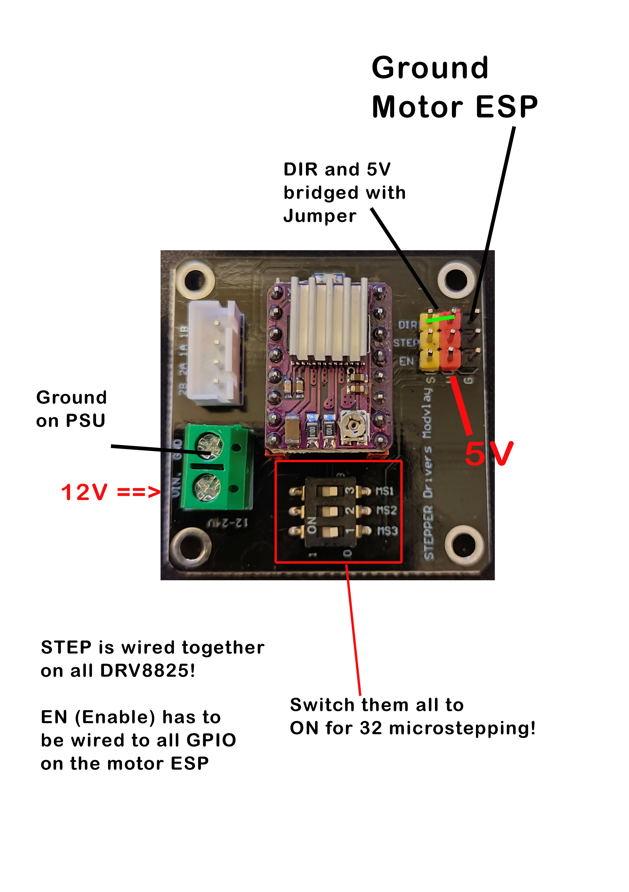
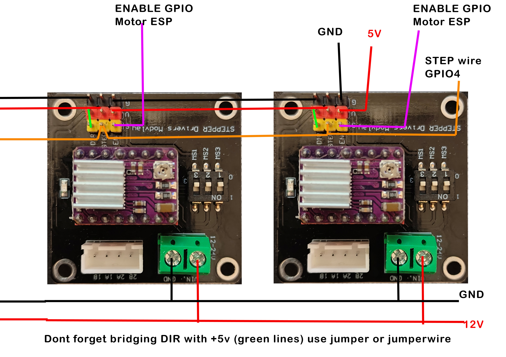

# Motor ESP Pinout

Language:

- [Deutsch](#deutsch)
- [English](#english)

---

## Deutsch

Diese Firmware in `src/main.cpp` ist fuer einen separaten ESP32-S3 als Motor-Controller gedacht.

Der Motor-ESP uebernimmt:

- 24 Stepper-Treiber ueber gemeinsame `STEP`-Leitung
- individuelle `ENABLE`-Leitungen pro Treiber
- Magnetschloss
- UART-Kommunikation mit dem Haupt-ESP

## UART zum Haupt-ESP

Aktuelle Konfiguration im Sketch:

- Motor-ESP `RX`: `GPIO15`
- Motor-ESP `TX`: `GPIO16`
- Baudrate: `115200`

Verdrahtung:

- Haupt-ESP `TX` -> Motor-ESP `RX (GPIO15)`
- Haupt-ESP `RX` <- Motor-ESP `TX (GPIO16)`
- `GND` beider ESPs verbinden

## Stepper-Pins

Gemeinsame `STEP`-Leitung:

- `GPIO4`

`ENABLE`-Leitungen der 24 Motoren:

1. Motor 1: `GPIO5`
2. Motor 2: `GPIO6`
3. Motor 3: `GPIO7`
4. Motor 4: `GPIO8`
5. Motor 5: `GPIO9`
6. Motor 6: `GPIO10`
7. Motor 7: `GPIO11`
8. Motor 8: `GPIO12`
9. Motor 9: `GPIO13`
10. Motor 10: `GPIO14`
11. Motor 11: `GPIO17`
12. Motor 12: `GPIO18`
13. Motor 13: `GPIO1`
14. Motor 14: `GPIO2`
15. Motor 15: `GPIO38`
16. Motor 16: `GPIO39`
17. Motor 17: `GPIO40`
18. Motor 18: `GPIO41`
19. Motor 19: `GPIO42`
20. Motor 20: `GPIO47`
21. Motor 21: `GPIO48`
22. Motor 22: `GPIO19`
23. Motor 23: `GPIO20`
24. Motor 24: `GPIO3`

Logik:

- `ENABLE` aktiv: `LOW`
- `ENABLE` inaktiv: `HIGH`

## Magnetschloss

- Schloss-Pin: `GPIO21`
- aktiv/offen: `HIGH`
- inaktiv/geschlossen: `LOW`

Standard-Pulsdauer:

- `5000 ms`

## Hinweise zur Verdrahtung

- Alle DRV8825-Treiber muessen eine gemeinsame `GND` mit dem Motor-ESP haben.
- Die gemeinsame `STEP`-Leitung geht an alle Treiber parallel.
- Jeder Treiber bekommt seine eigene `ENABLE`-Leitung.
- Aktuelle Motor-zu-Pin-Zuordnung: Motor 1->GPIO5, Motor 2->GPIO6, Motor 3->GPIO7, Motor 4->GPIO8, Motor 5->GPIO9, Motor 6->GPIO10, Motor 7->GPIO11, Motor 8->GPIO12, Motor 9->GPIO13, Motor 10->GPIO14, Motor 11->GPIO17, Motor 12->GPIO18, Motor 13->GPIO1, Motor 14->GPIO2, Motor 15->GPIO38, Motor 16->GPIO39, Motor 17->GPIO40, Motor 18->GPIO41, Motor 19->GPIO42, Motor 20->GPIO47, Motor 21->GPIO48, Motor 22->GPIO19, Motor 23->GPIO20, Motor 24->GPIO3.
- Wenn `DIR` ebenfalls ueber den Motor-ESP laufen soll, muss der Sketch erweitert werden. Aktuell unterstuetzt der Motor-ESP nur `STEP + ENABLE` entsprechend dem bestehenden Projektansatz.

## Relevante Stellen im Code

- Pin-Konfiguration: `src/main.cpp`
- Protokollbeschreibung: `PROTOCOL.md`

---

## English

This firmware in `src/main.cpp` is intended for a separate ESP32-S3 used as the motor controller.

The motor ESP handles:

- 24 stepper drivers through a shared `STEP` line
- individual `ENABLE` lines for each driver
- magnetic lock
- UART communication with the main ESP

## UART to the main ESP

Current configuration in the sketch:

- Motor ESP `RX`: `GPIO15`
- Motor ESP `TX`: `GPIO16`
- Baud rate: `115200`

Wiring:

- Main ESP `TX` -> Motor ESP `RX (GPIO15)`
- Main ESP `RX` <- Motor ESP `TX (GPIO16)`
- Connect `GND` between both ESPs

## Stepper pins

Shared `STEP` line:

- `GPIO4`

`ENABLE` lines for the 24 motors:

1. Motor 1: `GPIO5`
2. Motor 2: `GPIO6`
3. Motor 3: `GPIO7`
4. Motor 4: `GPIO8`
5. Motor 5: `GPIO9`
6. Motor 6: `GPIO10`
7. Motor 7: `GPIO11`
8. Motor 8: `GPIO12`
9. Motor 9: `GPIO13`
10. Motor 10: `GPIO14`
11. Motor 11: `GPIO17`
12. Motor 12: `GPIO18`
13. Motor 13: `GPIO1`
14. Motor 14: `GPIO2`
15. Motor 15: `GPIO38`
16. Motor 16: `GPIO39`
17. Motor 17: `GPIO40`
18. Motor 18: `GPIO41`
19. Motor 19: `GPIO42`
20. Motor 20: `GPIO47`
21. Motor 21: `GPIO48`
22. Motor 22: `GPIO19`
23. Motor 23: `GPIO20`
24. Motor 24: `GPIO3`

Logic:

- `ENABLE` active: `LOW`
- `ENABLE` inactive: `HIGH`

## Magnetic lock

- Lock pin: `GPIO21`
- active/open: `HIGH`
- inactive/closed: `LOW`

Default pulse duration:

- `5000 ms`

## Wiring notes

- All DRV8825 drivers must share `GND` with the motor ESP.
- The shared `STEP` line goes to all drivers in parallel.
- Each driver gets its own `ENABLE` line.
- Current motor-to-pin mapping: Motor 1->GPIO5, Motor 2->GPIO6, Motor 3->GPIO7, Motor 4->GPIO8, Motor 5->GPIO9, Motor 6->GPIO10, Motor 7->GPIO11, Motor 8->GPIO12, Motor 9->GPIO13, Motor 10->GPIO14, Motor 11->GPIO17, Motor 12->GPIO18, Motor 13->GPIO1, Motor 14->GPIO2, Motor 15->GPIO38, Motor 16->GPIO39, Motor 17->GPIO40, Motor 18->GPIO41, Motor 19->GPIO42, Motor 20->GPIO47, Motor 21->GPIO48, Motor 22->GPIO19, Motor 23->GPIO20, Motor 24->GPIO3.
- If `DIR` should also be controlled by the motor ESP, the sketch needs to be extended. At the moment the motor ESP only supports `STEP + ENABLE` based on the current project design.

## Relevant code locations

- Pin configuration: `src/main.cpp`
- Protocol description: `PROTOCOL.md`
